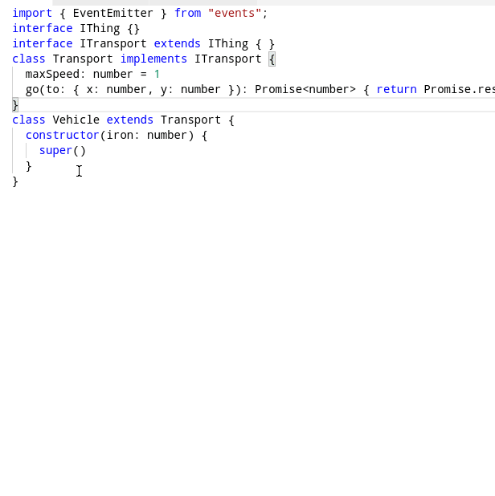
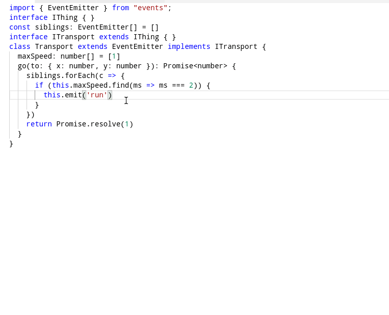

# typescript-plugin-ast-inspector

Tools to discover the AST of current TypeScript document. Oriented to TypeScript developers, specially those dealing Language Service Plugins. The one that stands most is "evalCode" that let the user write code in the guest editor that is evaluated host tsserver. Almost a developer tools experience. Other auxiliary  tools are "print ast" and "print parent nodes"

## Eval code 

This is the most important tool and probably will be maintained in its own project- but for now is here. 

TODO: youtube video and screencasts. 

## Print AST

Prints a simplified representation of the selected node's AST: 



## Print parent nodes

Prints a simplified representation of the selection's parent nodes in the AST up to the top-most node (SourceFile). 



## How to use: 

```sh
npm i --save-dev typescript-plugin-ast-inspector
```

in your `tsconfig.json`, add the plugin: 

```json
{
  "compilerOptions": {
    "plugins": [{
        "name": "typescript-plugin-plugin-ast-inspector"
    }]
  }
}
```

Make sure you have installed typescript in your project (`npm i --save-dev typescript`) the editor you are using uses that typescript and not another. For example, Visual Studio Code comes with its own typescript version, so I need to "TypeScript: Select TypeScript Version" of the workspace: 
```json
{
  "typescript.tsdk": "node_modules/typescript/lib"
}
```
