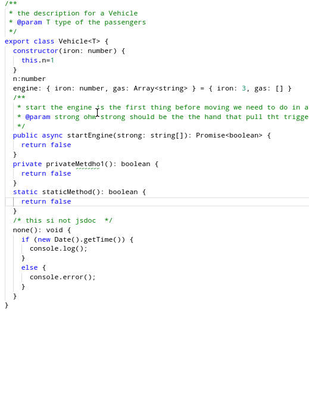

# Obsolete

obsolete by typescript-plugin-proactive-code-fixes - code fix extractInterface. 


# typescript-plugin-extract-interface


A TypeScript Language Server Plugin to extract an interface from an existing class. 

Tested: 
 
 * generic parameters, 
 * methods, properties, constructor
 * static, protected and private methods won't appear

 


#How to use: 

```sh
npm i --save-dev typescript-plugin-extract-interface
```

in your `tsconfig.json`, add the plugin: 

```json
{
  "compilerOptions": {
    "plugins": [{
        "name": "typescript-plugin-extract-interface"
    }]
  }
}
```


Make sure you have installed typescript in your project (`npm i --save-dev typescript`) the editor you are using uses that typescript and not another. For example, Visual Studio Code comes with its own typescript version, so you need to "Select TypeScript Version" of the workspace: 
```json
{
  "typescript.tsdk": "node_modules/typescript/lib"
}
```

In Atom editor, if you use [atom-typescript package](https://atom.io/packages/atom-typescript) you don't need to do anything since by default it will use the workspace's TypeScript version.

# ISSUES / TODOS

 * can use this to format : https://www.npmjs.com/package/code-block-writer
 * make the class implement the interface at the end
 * if the class already implements an interface, we shouldn't extract those methods. 
 * what about methods of super classes ? this behavior could be configurable
 * put the interface in a separate file and add an import?
 * fix format
 * feature, if user selects only some methods, we should only extract those. 
 * good enhancement: i just finish writting a class . at last I add "implements SomeName" . Because the interface doesn't exist, would be super if the plugin suggest me there a refactor for creating / extracting it