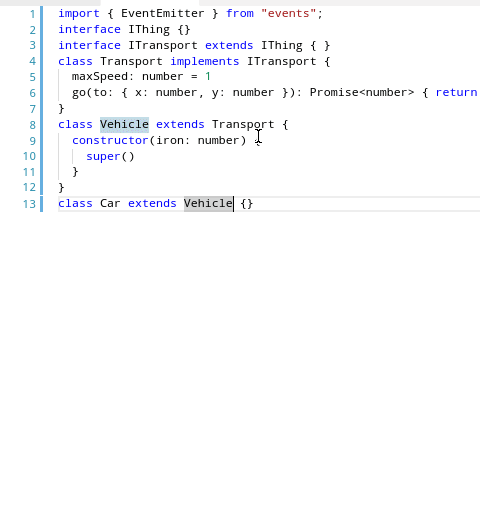

# typescript-plugin-subclasses-of

A TypeScript Language Server Plugin that, given a class or a interface, prints the classes or interfaces that (directly or indirectly) are extending/implementing it. 

 * user has to select (part of) the name of class of interface for refactor to be suggested
 * prints the output at the end of current file with links to the exact position (ctrl-click will take you there)

**Important** as noticed in the demo, if you select a class/interface with many subclasses (like EventEmitter) it will take some seconds to finish



## How to use: 

```sh
npm i --save-dev typescript-plugin-subclasses-of
```

in your `tsconfig.json`, add the plugin: 

```json
{
  "compilerOptions": {
    "plugins": [{
        "name": "typescript-plugin-subclasses-of"
    }]
  }
}
```

Make sure you have installed typescript in your project (`npm i --save-dev typescript`) the editor you are using uses that typescript and not another. For example, Visual Studio Code comes with its own typescript version, so I need to "Select TypeScript Version" of the workspace: 
```json
{
  "typescript.tsdk": "node_modules/typescript/lib"
}
```

# TODO


 * moe this to ast-inspector and make this separate plugin obsolete
  * refactor subclasses-of to use simple-ast helpers for performance. 
 * (important) TODO: use getImplementationsOf(of) should be much faster in case of big hierarchies like EventEmitter
 * 